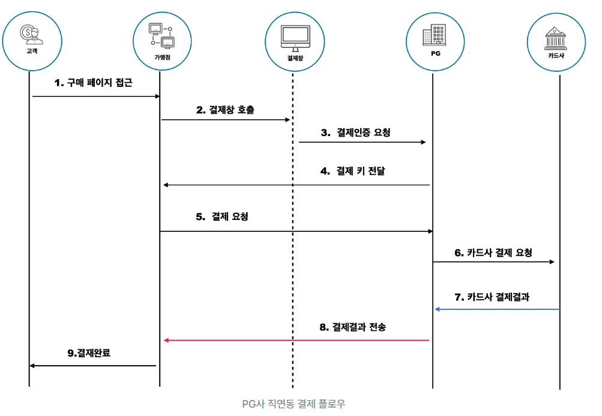

### 포트원(아임포트)?
```
결제 기능을 지원하는 솔루션으로 여러 결제 수단 사용 가능
https://portone.io/korea/ko

v2 API를 통해 테스트 결제 진행 (카카오페이)
결제, 결제취소, 결제정보 조회
```

* 결제 플로우


### 포트원 기본 설정
```
https://developers.portone.io/opi/ko/integration/ready/readme?v=v2
1. 회원가입
2. 관리자 콘솔 접속 (https://admin.portone.io/)
3. 결제 연동
실연동 말고 테스트 선택
결제 채널 생성: 
결제모듈(카카오페이)
채널이름: 맘대로
mid: INIpayTest
```

### 코드를 통해 포트원 연결 
```
https://developers.portone.io/opi/ko/quick-guide/payment?v=v2

1. 포트원 모듈 설치
npm i @portone/browser-sdk

2. 샘플 코드 가져오기

3. 결제 요청 부분 수정
스토어 아이디: 콘솔에서 오른쪽 상단에 있음
채널 키: 채널에 있음

IMP란? 
라이브러리에서 꺼내온 객체로, 결제 모듈

```

### 결제 내역 확인
```
관리자 콘솔 > 결제 내역
필터 > 결제모드 - 테스트 결제 선택
```

